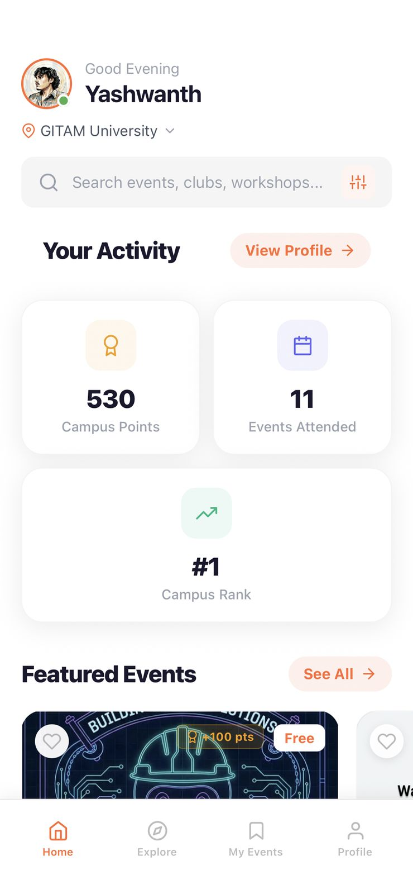
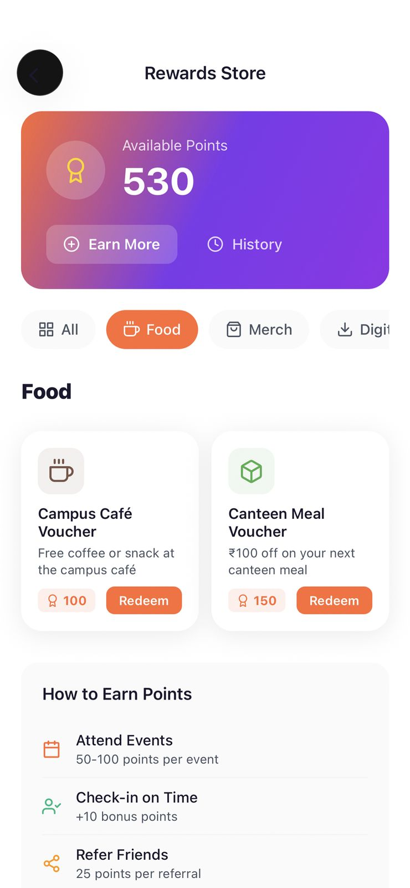
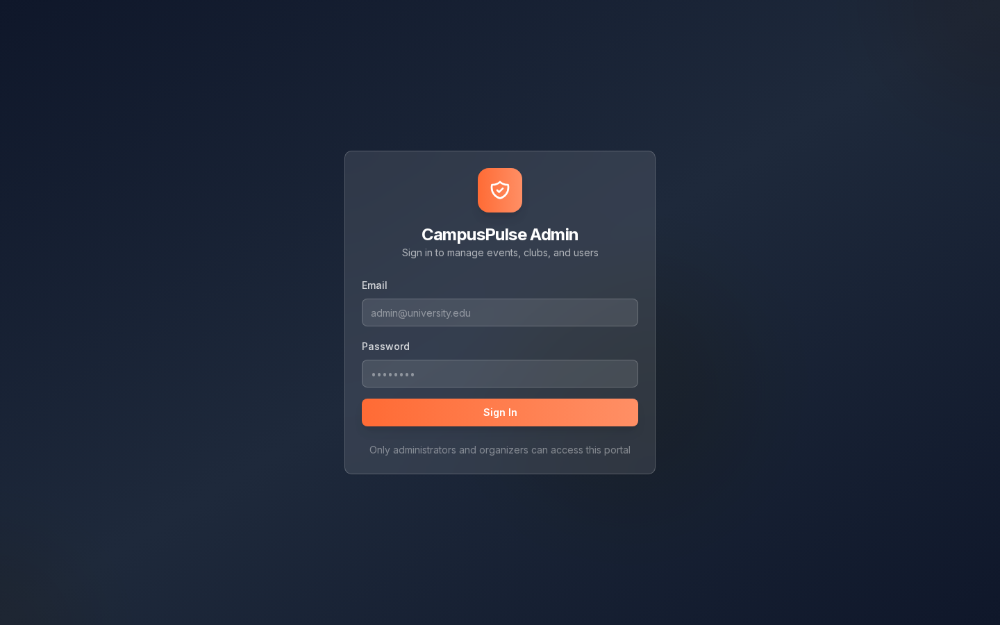

# CampusPulse

Campus event platform built by team **V3CT0R SYND1CAT3S** — one place to discover campus events, register without clashes, check in by QR, and build a campus identity through points, badges, and rewards.

Two apps, one Supabase backend:

| App | Stack | What it does |
|---|---|---|
| [`apps/mobile`](apps/mobile) | Expo 54 · React Native 0.81 · Expo Router · NativeWind · Zustand · React Query · Supabase | Student app: event discovery & registration, tickets with QR check-in, notifications & reminders, profile with achievements/clubs/rewards, leaderboard, organizations, onboarding |
| [`apps/admin`](apps/admin) | Next.js 14 · Radix/shadcn · Recharts · Supabase | Organizer dashboard: events & clubs management, users, QR scanner, leaderboard, analytics |

The UI follows an Evenro-inspired design system (vibrant orange palette, modern components) — see [`apps/mobile/DESIGN_SYSTEM.md`](apps/mobile/DESIGN_SYSTEM.md).

## The product

| | | | |
|---|---|---|---|
|  |  |  |  |
|  |  |  |  |



## Getting started

```bash
cd apps
npm run install:all        # installs mobile + admin dependencies
```

**Mobile** — create `apps/mobile/.env` (see `.env.example`):

```
EXPO_PUBLIC_SUPABASE_URL=...
EXPO_PUBLIC_SUPABASE_ANON_KEY=...
```

```bash
npm run dev:mobile         # Expo dev server (also: dev:mobile:tunnel / dev:mobile:lan)
```

**Admin** — create `apps/admin/.env.local` (see `.env.example`):

```
NEXT_PUBLIC_SUPABASE_URL=...
NEXT_PUBLIC_SUPABASE_ANON_KEY=...
```

```bash
npm run dev:admin          # Next.js on :3000
```

Database schema and seed data live in [`apps/mobile/supabase/migrations`](apps/mobile/supabase/migrations) and [`apps/admin/database`](apps/admin/database).

> **Never commit** `.env` files — the Supabase service-role key bypasses row-level security.

## Repository layout

```
apps/
├── package.json      # monorepo scripts (dev:mobile, dev:admin, build:*, install:all)
├── mobile/           # Expo app — app/ routes, components/ui, lib/{hooks,services,supabase}
└── admin/            # Next.js app — src/app/dashboard/*, src/components/ui
```
